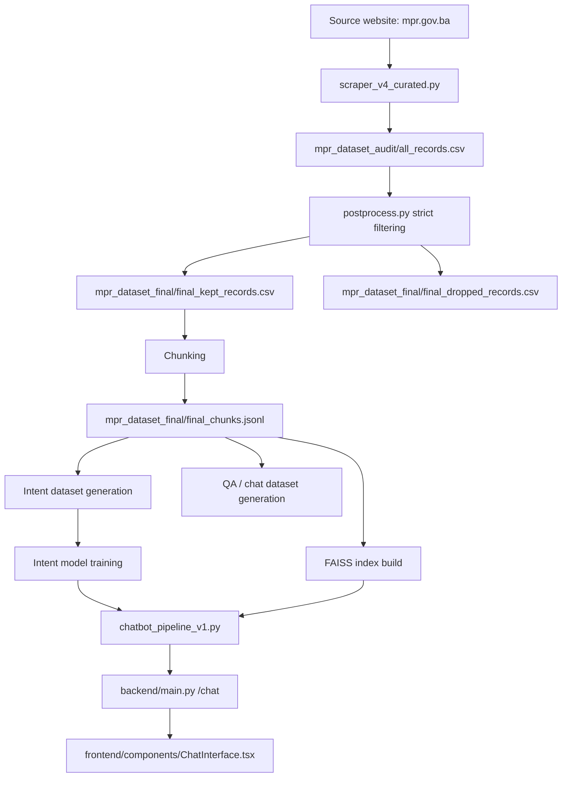

# Dataset Structure and Pipeline (Project-Aligned)

## Overview
This document describes the actual data flow used by the DAP project: from scraping Ministry of Justice BiH content to retrieval-ready chunks and model-ready datasets.

## End-to-End Flow

## Pipeline Stages

### 1) Data Collection
- Script: `/home/runner/work/DAP/DAP/efendicemina/DAP/chatbot/scraper_v4_curated.py`
- Output: audited raw records (CSV/JSONL variants in dataset folders)
- Purpose: collect curated pages from `mpr.gov.ba` relevant to legal/admin guidance.

### 2) Audit and Strict Filtering
- Script: `/home/runner/work/DAP/DAP/efendicemina/DAP/chatbot/postprocess.py`
- Main output files:
  - `chatbot/mpr_dataset_final/final_kept_records.csv`
  - `chatbot/mpr_dataset_final/final_dropped_records.csv`
- Purpose: remove noisy, duplicated, off-topic, too-short, or low-value records.

### 3) Chunk Preparation
- Output: `chatbot/mpr_dataset_final/final_chunks.jsonl`
- V5 runtime dataset used by the pipeline:
  - `chatbot/mpr_dataset_v5/chunks_v5.csv`
- Purpose: convert long documents into retrieval-friendly chunks with metadata.

### 4) Dataset Derivatives
- Intent dataset tooling:
  - `chatbot/make_intent_dataset.py`
  - `chatbot/train_intent_model.py`
  - `chatbot/train_intent_contextual_model.py`
- Evaluation tooling:
  - `chatbot/evaluate_task1_query_understanding.py`
  - `chatbot/evaluate_task3_generation.py`
  - `chatbot/evaluate_rag_embeddings_v5.py`

### 5) Retrieval and Serving Assets
- Intent model: `chatbot/models/intent_classifier.joblib`
- Embedding config: `chatbot/models_v5/embedding_config_v5.joblib`
- FAISS index: `chatbot/models_v5/faiss_index_v5.bin`
- Runtime orchestrator: `chatbot/chatbot_pipeline_v1.py`

## Runtime Behavior in Production Flow
1. User sends a question from the frontend.
2. Backend `/chat` endpoint calls `ask()` in `chatbot_pipeline_v1.py`.
3. Pipeline performs:
   - intent classification,
   - direct URL routing for known patterns,
   - embedding retrieval + reranking,
   - few-shot/rule-based answer composition.
4. Backend returns answer text, confidence, intent, and source list.
5. Frontend renders the message and source links.

## Notes
- The current pipeline is retrieval-first and source-grounded.
- `USE_LOCAL_LLM` exists in the pipeline but is disabled by default.
- If ML assets fail to load, backend falls back to `dummy_responses.py`.
