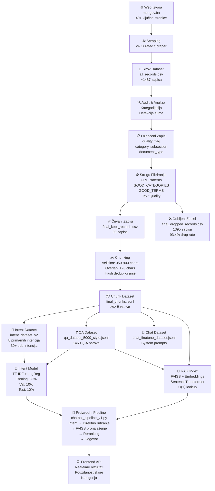
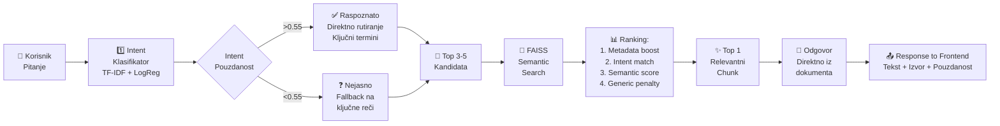
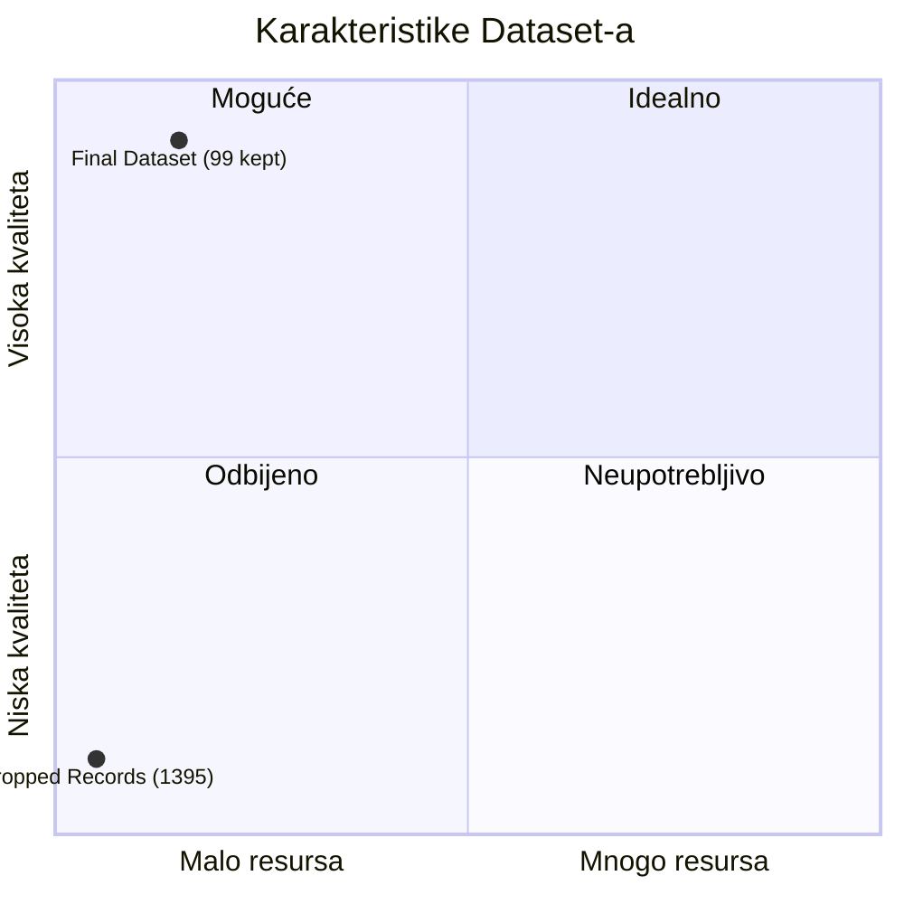

# Struktura i Funkcionalnost Dataset-a - Detaljno Objašnjenje

## 1. Grafički prikaz kompletnog dataset pipeline-a

*Slika: Dataset_Pipeline_Kompletna_Struktura.png*



**Opis**: Овај dijagram pokazuje kompletan tok podataka od prikupljanja do finalnog korišćenja. Svaka faza ima specifičnu funkciju u čiščenju, organizovanju i strukturiranju podataka za mašinsko učenje i pronalaženje relevantnih odgovora.

---

## 2. Detaljeta struktura svake faze

### Faza 1: Priklupljanje podataka (Web Scraping)

```
INPUT: mpr.gov.ba website
↓
scraper_v4_curated.py
├── Hardkovani URL-ovi (40+ ključne stranice)
├── Sitemap fallback
├── Category/Subsection inferencing
└── Output: all_records.csv
```

**Polje u all_records.csv:**
- `source_url` - Direktan link na stranicu
- `title` - Naslov stranice/dokumenta
- `text` - Kompletan sadržaj teksta
- `category` - Kategorija (registracija, obrasci, zakoni, itd.)
- `subsection` - Potkategorija
- `document_type` - Tip (zakon, obrazac, uputstvo, itd.)
- `crawl_time` - Vreme prikupljanja
- `quality_flag` - Početna kvalifikacija (duplicate, irrelevant, too_short)

---

### Faza 2: Audit i Analiza

```
INPUT: all_records.csv (1487 zapisa)
↓
postprocess.py - decide_final_keep()
├── URL Filtriranja:
│   ├── /hr, /en, /sr (ne želimo druge jezike)
│   ├── /portal/objava/, /portal?categorySlug=vijesti (news)
│   ├── tenderi, konkursi, galerija, projekti (ne-relevantno)
│   └── strategije, eu4justice (off-topic)
│
├── Tekstualna Filtriranja:
│   ├── Minimum 250 karaktera (too_short)
│   ├── Detektuj "vijesti vijesti" (news listing)
│   └── Zahteva ključne termini iz GOOD_TERMS
│
└── Kategorijska Filtriranja:
    ├── Čuvaj ako je u GOOD_CATEGORIES
    ├── Čuvaj ako ima GOOD_TERMS
    └── Odbij sve ostale (kept_* vs dropped_*)
```

**GOOD_CATEGORIES (8 ključnih):**
- `registracija` - Registracija preduzeća/udruženja
- `obrasci` - Obrazci i dokumentacija  
- `zakoni_i_propisi` - Zakoni i pravilnici
- `pravna_pomoc` - Besplatna pravna pomoć
- `notari` - Notarijalni poslovi
- `sudski_tumaci` - Sudski tumbači
- `ispiti` - Profesionalni ispiti
- `registri` - Javni registri

**GOOD_TERMS (30 ključnih reči):**
Zahtjev, obrazac, registracija, preregistracija, udruženje, fondacija, zakon, pravilnik, propis, pravna pomoć, notar, sudski tumač, pravosudni ispit, stručni upravni ispit, registar, taksa, dokumentacija, nadležnost, rok, rješenje, itd.

---

### Faza 3: Finalna Filtriranja i Split

```
REZULTAT:
├── ✅ ČUVANO: final_kept_records.csv
│   ├── 99 zapisa (6.6% od originalnih)
│   ├── Razlog: kept_good_category ili kept_good_terms
│   └── Obeleo kao relevantno za chatbot
│
└── ❌ ODBIJENO: final_dropped_records.csv
    ├── 1395 zapisa (93.4% od originalnih)
    └── Razlozi:
        ├── dropped_by_strict_url_filter
        ├── dropped_quality_duplicate
        ├── dropped_quality_irrelevant
        ├── dropped_quality_too_short
        ├── dropped_bad_or_short_text
        └── dropped_not_useful_for_chatbot
```

**Zašto tolika agresivna filtracija?**
Dataset je kvalitetom važniji od količine. 99 relevantnih zapisa je bolje nego 1487 miješanih - system dobija čine i preciznost.

---

### Faza 4: Chunking - Razdvajanje na manje delove

```
INPUT: final_kept_records.csv (99 zapisa)
↓
chunk_text() funkcija
├── Parametri:
│   ├── MIN_CHUNK_CHARS = 350 (minimum za smislenost)
│   ├── MAX_CHUNK_CHARS = 900 (maksimum za model)
│   └── OVERLAP = 120 (preklapanje između chunks-a)
│
├── Proces:
│   ├── Dužan tekst se seče na 900 char komade
│   ├── Sledeci komad počinje 120 karaktera pre kraja prethodnog
│   ├── Hash dedupliciranje (uklanja duplikate)
│   └── Samo chunks sa ≥350 karaktera se čuvaju
│
└── OUTPUT: final_chunks.jsonl (292 čunkova)
```

**Primer chunking-a:**

```
Originalni tekst (2000+ karaktera):
"REGISTRACIJA UDRUŽENJA - Udruženje je oblik organizovanja građana... 
Zahtjev treba biti prijavljio u tri primjerka... Rok za rješenje je 30 dana..."

Chunk 1 (350-900 chars):
"REGISTRACIJA UDRUŽENJA - Udruženje je oblik organizovanja građana...
[350-900 karaktera]"

Chunk 2 (sa overlap-om od 120 chars):
"...rješenja prema prethodnoj uputi. Zahtjev treba biti prijavljio 
u tri primjerka... [350-900 karaktera]"

Chunk 3:
"...pored postojeće dokumentacije. Rok za rješenje je 30 dana..."
```

---

### Struktura final_chunks.jsonl

Svaki chunk je u JSON formatu sa sledećim poljima:

```json
{
  "chunk_id": "a3f4e8d2_0",
  "source_url": "https://www.mpr.gov.ba/bs/registracija-uduhenja",
  "title": "Registracija udruženja - Ministarstvo Pravde",
  "category": "registracija",
  "document_type": "uputstvo",
  "chunk_index": 0,
  "text": "REGISTRACIJA UDRUŽENJA - Udruženje je oblik organizovanja građana sa zajedničkim interesima. Za registraciju je potrebno predložiti tri primjerka zahteva sa sledećim dokumentima...[sadržaj čunkа]"
}
```

**Polja:**
- `chunk_id` - Jedinstveni identifikator (hash_url + index)
- `source_url` - Izvor ovog čunkа
- `title` - Naslov originalnog dokumenta
- `category` - Kategorija (za intent routing)
- `document_type` - Tip dokumenta
- `chunk_index` - Redosled čunkа iz originala
- `text` - Sadržaj (350-900 karaktera)

---

## 3. Iz čunkova do ML dataset-a

### 3A: QA Dataset (qa_dataset_5000_style.jsonl)

```
INPUT: final_chunks.jsonl (292 čunkova)
↓
Za svaki chunk generiši 5 template pitanja:
├── 1. "Šta korisnik treba znati o temi: {title}?"
├── 2. "Objasni jednostavno sadržaj dokumenta '{title}'."
├── 3. "Koje su najvažnije informacije iz oblasti {category}?"
├── 4. "Koji su ključni uslovi, dokumenti ili koraci navedeni u tekstu '{title}'?"
└── 5. "Na osnovu dostupnog teksta, kako pomoći korisniku koji pita..."

OUTPUT: qa_dataset_5000_style.jsonl (1460 Q-A parova)
```

**Format:**
```json
{
  "instruction": "Šta korisnik treba znati o temi: Registracija udruženja?",
  "input": "",
  "output": "Udruženje je oblik organizovanja građana sa zajedničkim interesima. Za registraciju je potrebno...[chunk tekst]\n\nIzvor: https://www.mpr.gov.ba/bs/registracija-uduhenja",
  "source_url": "https://www.mpr.gov.ba/bs/registracija-uduhenja",
  "title": "Registracija udruženja - Ministarstvo Pravde",
  "category": "registracija"
}
```

**Zašto ovaj format?**
- `instruction` - Pitanje sa template-om koji ima varijacije
- `input` - Obično prazno za ovaj tip zadatka
- `output` - Odgovor direktno iz dokumenta sa izvorom
- Metapodaci - Za kasnije filtriranje i analizu

---

### 3B: Chat Dataset (chat_finetune_dataset.jsonl)

```
INPUT: qa_dataset_5000_style.jsonl
↓
Konvertuj u chat format sa system prompt:

OUTPUT: chat_finetune_dataset.jsonl
```

**Format:**
```json
{
  "messages": [
    {
      "role": "system",
      "content": "Ti si chatbot Ministarstva pravde BiH. Odgovaraš jasno, jednostavno i isključivo na osnovu dostupnog izvora. Ako informacija nije dovoljna, reci korisniku da provjeri zvanični izvor."
    },
    {
      "role": "user",
      "content": "Šta korisnik treba znati o temi: Registracija udruženja?"
    },
    {
      "role": "assistant",
      "content": "Udruženje je oblik organizovanja građana... [odgovor]"
    }
  ]
}
```

---

### 3C: Intent Dataset (intent_dataset_v2)

```
INPUT: qa_dataset_5000_style.jsonl
↓
Ekstrahuji samo pitanja → Kategoriziraj:

Naslov i kategorija iz Q-A parova
Generiši intent labelu:
    - registracija, obrasci, zakon, pravna_pomoc, notar, sudski_tumac,
    - ispiti, registri, kontakt, itd.

OUTPUT: intent_dataset_v2.csvintent_dataset_v2.jsonl
```

**Format:**
```
question,intent,category
"Kako registrovati udruženje?",registracija,registracija
"Trebam obrazac za registraciju",obrasci,registracija
"Koji su zakoni relevantni?",zakoni,zakoni_i_propisi
...
```

**Split:**
```
Training (80%): intent_train.csv
Validation (10%): intent_val.csv
Testing (10%): intent_test.csv
```

**Zašto 8 primarnih intencija?**
Pokrivaju sve glavne kategorije korisničkih pitanja - od registracije, preko obrazaca, do zakonske pomoći.

---

## 4. Kako funkcioniše pronalaženje relevantnog sadržaja na bazi ovog dataset-a



**Proces:**
1. Korisnik postavи pitanje
2. Intent model prepozna intenciju (sa 55% prag pouzdanosti)
3. Ako je sigurna: koristi direktno rutiranje sa ključnim terminima
4. Ako nije sigurna: koristi keyword fallback
5. FAISS-om pretraži 220+ semantički sličnih čunkova
6. Reranking: primeni metapodatke, intent score, i penalitete za generičke stranice
7. Vrati Top-1 chunk
8. Generiši odgovor iz originalnog teksta
9. Prosledi na frontend sa pouzdanošću i izvorom

---

## 5. Statistika Dataset-a



**Brojevi:**

| Metrika | Vrednost |
|---------|----------|
| Original records | 1,487 |
| **Final kept records** | **99 (6.6%)** |
| **Final drop rate** | **93.4%** |
| Drop by URL filter | 315 |
| Drop by quality flag | 542 |
| Drop by text quality | 423 |
| Drop by not useful | 215 |
| **Total chunks** | **292** |
| **Avg chunk length** | **~650 chars** |
| **Min chunk length** | **350 chars** |
| **Max chunk length** | **900 chars** |
| QA pairs generated | 1,460 |
| Intent categories | 8 primary |
| Intent sub-categories | 30+ |

---

## 6. Tok podataka tokom pronalaženja

```
PRIMER:
🟦 Korisnik: "Kako registrovati malo preduzeće?"

🔹 Intent prediction:
   - TF-IDF ekstraktuje ključne reči: registrovanje, preduzeće
   - LogReg predviđa: Intent=registracija (confidence=0.72)

🟦 Direktno rutiranje:
   - Confidence > 0.55 ✓
   - Koristi hardkodovani URL rules za registraciju
   - OR koristi FAISS sa semantic search

🟦 FAISS pretraga:
   - Konvertuj pitanje u vektor (SentenceTransformer)
   - Pronađi 5 closest chunks po cos-similarity

🟦 Ranking:
   - Base score: cos_similarity_score
   - +boost ako je category==Intent
   - -penalty ako je generic stranica (mpr.gov.ba/bs home)
   - +boost ako su key termini prisutni

🟦 Output:
   ✓ Best matching chunk
   ✓ Source URL
   ✓ Confidence score (0.92)
   ✓ Category
```

---

## 7. Key Takeaways - Ključne karakteristike

1. **Agresivna filtracija za kvalitet**: Potrebna je samo 1 chunk od 5-6 originala, ali ti su od najpreciznije važnosti za chatbot
2. **Chunking sa overlap**: Overlap od 120 karaktera osigurava da se kontekst ne gubi između chunks-a
3. **Metadata je bitna**: category, title, document_type se koriste za reranking i direktno rutiranje
4. **Template-based QA**: 5 pitanja po chunk-u generiše varijacije koje model vidi tokom obuke
5. **Intent pre pronalaženja**: Intent klasifikator prvo sužava prostor pretrage pre nego što idu u FAISS
6. **Hybrid pronalaženje**: TF-IDF (ključne reči) + Embeddingi (semantika) zajedno deluju bolje nego samo jedan

---

## 8. Kako koristiti ove informacije

- **Za izvještaj**: Kopiraj grafiku i tabelе odozgo
- **Za razumevanje**: Pipeline ide: Raw data → Clean data → Chunks → ML datasets → Production model
- **Za poboljšanja**: Ako je accuracy niska, razmotri da proslediš više čunkova ili da promeniš prioritete u rangiranju
