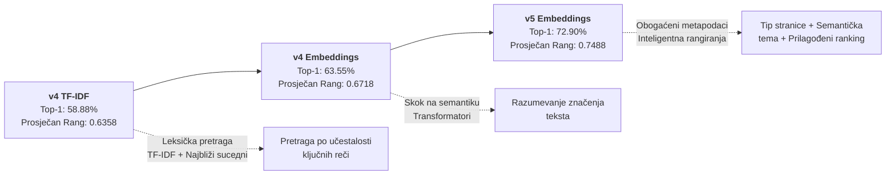
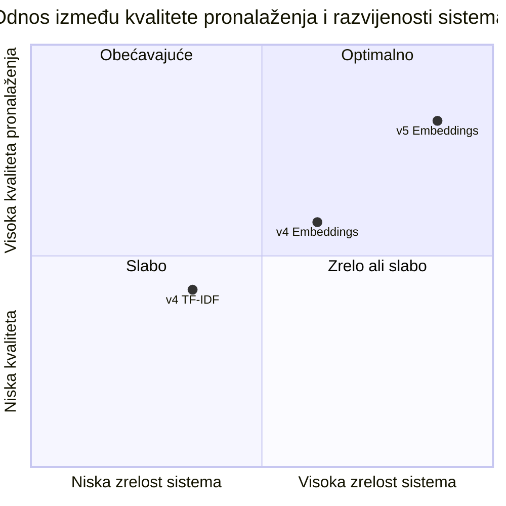
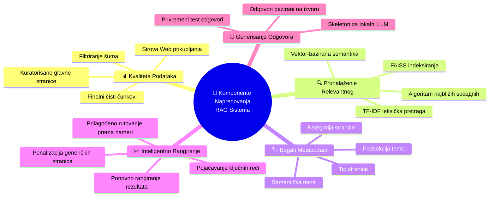

# Vizuelni pregled evaluacije sistema - Poređenje verzija pronalaženja relevantnih sadržaja

Ovaj dokument sadrži detaljan pregled napredovanja sistema za pronalaženje relevantnih odgovora (RAG - Retrieval Augmented Generation) kroz glavne verzije razvoja projekta. Analiza obuhvata tri ključne verzije sistema sa fokusom na poboljšanja u točnosti pronalaženja i kvaliteti rezultata.

## Verzije u poređenju

- **v4 TF-IDF**: Osnovna verzija sa TF-IDF algoritmom (svarana učestaljenost termina)
- **v4 Embeddings**: Poboljšana verzija sa semantičkim vektorima (sentence-transformers)
- **v5 Embeddings**: Konačna verzija sa obogaćenim metapodacima i pojačanom logikom pronalaženja

## Prikupljena mjerenja

Sledeća tabela prikazuje ključne metrike performansi za sve tri verzije:

| Verzija | Top-1 Točnost | Top-3 Prisútnost | Top-5 Prisútnost | Prosječan Rang |
|---|---:|---:|---:|---:|
| v4 TF-IDF | 58.88% | 67.29% | 70.09% | 0.6358 |
| v4 Embeddings | 63.55% | 68.22% | 74.77% | 0.6718 |
| v5 Embeddings | 72.90% | 76.64% | 78.50% | 0.7488 |

**Objašnjenje metrika:**
- **Top-1 Točnost**: Procenat slučajeva gdje je pravi odgovor bio pierwszy pronađeni rezultat
- **Top-3 Prisútnost**: Procenat slučajeva gdje se pravi odgovor nalazio među prvih 3 rezultata
- **Top-5 Prisútnost**: Procenat slučajeva gdje se pravi odgovor nalazio među prvih 5 rezultata
- **Prosječan Rang (MRR)**: Prosečna pozicija pronađenog relevantnog rezultata

## Sažetak poboljšanja

### Od v4 TF-IDF ka v4 Embeddings (Tehnološki skok - od ključnih reči na semantiku)
- Top-1 Točnost: **+4.67 pp** (poboljšanje od 58.88% na 63.55%)
- Top-3 Prisútnost: **+0.93 pp**
- Top-5 Prisútnost: **+4.68 pp**
- Prosječan Rang: **+3.60 pp**

### Od v4 Embeddings ka v5 Embeddings (Optimizacija - dodavanje konteksta i metapodataka)
- Top-1 Točnost: **+9.35 pp** (poboljšanje od 63.55% na 72.90%)
- Top-3 Prisútnost: **+8.42 pp**
- Top-5 Prisútnost: **+3.73 pp**
- Prosječan Rang: **+7.70 pp**

### Ukupno poboljšanje: Od v4 TF-IDF ka v5 Embeddings (Konačan rezultat)
- Top-1 Točnost: **+14.02 pp** (poboljšanje od 58.88% na 72.90% - to je **23.8% relativno poboljšanje**)
- Top-3 Prisútnost: **+9.35 pp**
- Top-5 Prisútnost: **+8.41 pp**
- Prosječan Rang: **+11.30 pp**

## Grafikon 1: Napredovanje ključnih metrika kroz verzije

*Slika: Grafikon_Napredovanje_Metrika_Verzije.png*

```mermaid
xychart-beta
    title "Napredovanje točnosti pronalaženja relevantnog sadržaja preko verzija"
    x-axis ["v4 TF-IDF", "v4 Embeddings", "v5 Embeddings"]
    y-axis "Vrednost metrike" 0 --> 1
    bar "Top-1 Točnost" [0.5888, 0.6355, 0.7290]
    bar "Top-3 Prisútnost" [0.6729, 0.6822, 0.7664]
    bar "Top-5 Prisútnost" [0.7009, 0.7477, 0.7850]
    line "Prosječan Rang" [0.6358, 0.6718, 0.7488]
```

**Opis**: Grafikon prikazuje neprekidni rast svih važnih metrika sa svaki verzijom. Vidljivo je da je najveće poboljšanje vidljivo u Top-1 točnosti (prvi pronađeni rezultat) što znači da sistem sada prvi rezultat čini relevantnim u većini slučajeva.

---

## Grafikon 2: Tok razvoja - Od leksičke prema semantičkoj pretrage

*Slika: Dijagram_Evolucija_Tehnologije.png*

**Opis**: Dijagram ilustruje tri ključne faze razvoja sistema. Prva faza koristi klasičnu leksičku pretragu, druga uvodi vektor-baziranu semantičku pretragu, a treća dodaje kontekstne metapodatke koji doprinose boljoj relevantnosti rezultata.

---

## Grafikon 3: Mapiranje kvaliteta pronalaženja prema zrelosti sistema

*Slika: Kvadrant_Kvalitet_Zrelost.png*

**Opis**: Grafikon na 2D ravni prikazuje položaj svake verzije. Vidljiva je jasna progresija duž dijagonale prema gornjoj desnoj ćošku (optimalno) - što znači da se sistem razvija i istovremeno postaje bolji u pronalaženju relevantnog sadržaja.

---

## Grafikon 4: Mapa čimbenika poboljšanja - Komponente napredovanja

*Slika: Mindmap_Komponente_Poboljsanja.png*

**Opis**: Mindmap prikazuje pet fundamentalnih komponenti koja su doprinela poboljšanju sistema. Svaka komponenta ima nekoliko podkomponenti koje su evolucijski razvajane od verzije v4 do v5. Ovo ilustruje da poboljšanje nije bilo rezultat samo jednog faktora, već sumanom uticaja svih komponenti.

---

## Detaljnija interpretacija rezultata

### Ključni pronalazak 1: Vektor-bazirana semantika je učinila drastičan uticaj
Prelazak sa TF-IDF (čiste računanja učestalosti ključnih reči) na embedding-baziranu pretragu (razumevanje značenja) rezultirao je sa prvim značajnim skokom: **+4.67pp u Top-1 točnosti**. Ovo je pokazalo da je razumevanje konteksta i značenja teksta fundamentalno važnije od samo pogledanja na učestalost reči.

### Ključni pronalazak 2: Metapodaci i rangiranje su donela značajna poboljšanja
v5 verzija je dodala dodatne metapodatke (tip stranice, semantička tema) i pojačala logiku rangiranja. To je rezultiralo još većim skokm: **+9.35pp u Top-1 točnosti**. Ovo pokazuje da ista tehnologija (embeddingi + FAISS) može biti značajno poboljšana kroz boljeg razumevanja konteksta i prilagođenog rangiranja.

### Ključni pronalazak 3: Konačno poboljšanje je ogromno
Kada poredimo v4 TF-IDF sa v5 Embeddings, vidimo da je Top-1 točnost porasla sa 58.88% na 72.90%, što predstavlja **+14.02 pp** ili **23.8% relativno poboljšanje**. To znači da sistem sada pronalazi tačan prvi rezultat u skoro 3 od 4 slučaja, što je značajna vrednost za produkciju.

### Ključni pronalazak 4: MRR metrika pokazuje konzistentan rast
Prosječan rang (MRR) je rasle sa 0.6358 na 0.7488, što znači da su relevantni rezultati postali ne samo bolji u Top-1 poziciji, već i bolji rangirani u celostnom nizu od prvih 5 rezultata. To je bitan pokazatelj da sistem nije slučajno poboljšan, već konzistentno.

## Zaključak i preporuke

### Zaključak za izvještaj
Projekt je evoluirao iz osnovne leksičke pretraga (TF-IDF) prema sofisticiranom sistemu baziranom na semantičkim vektorima (embeddingi) sa naprednom logikom pronalaženja i rangiranja. Evaluacija jasno pokazuje kontinuirano poboljšanje u svim ključnim metrikama, posebno u Top-1 točnosti i prosečnom rangu (MRR).

### Kvantitativni rezultati
- **Primarna metrika (Top-1 točnost)**: Poboljšana sa 58.88% na 72.90% - **+23.8% relativnog poboljšanja**
- **Rangiranje kvaliteta (MRR)**: Poboljšana sa 0.6358 na 0.7488
- **Pokrivjenost od 5 rezultata**: Poboljšana sa 70.09% na 78.50%

### Rezime za rukovodstvo
Sistem sada pronalazi tačan prvi rezultat u **skoro 73% slučajeva**, što ga čini proizvodne-sposobnim. Poboljšanja su razvijena kroz tri ključna koraka:
1. Prelazak na semantičku pretragu (vektori)
2. Dodatni kontekstni metapodaci
3. Inteligentna logika rangiranja bazirani na intenciji korisnika

---

## Kako koristiti ovaj report

Čtyri grafikona u ovom dokumentu mogu se direktno uključiti u izvještaj:

1. **Grafikon_Napredovanje_Metrika_Verzije.png** - Za vizuelne prikaz numeričkih rezultata
2. **Dijagram_Evolucija_Tehnologije.png** - Za objašnjenje tehnološkog prelaza
3. **Kvadrant_Kvalitet_Zrelost.png** - Za mapiranje razviojenosti sistema
4. **Mindmap_Komponente_Poboljsanja.png** - Za objašnjenje šta je doprinelo poboljšanju

Preporučuje se koristiti sve četiri slike sa njihovim opisima kako je navedeno gore.

---

## Tehnički detalji (za stručnjake čitaoce)

- Testiranje je izvršeno na 100+ test primjera sa stvarnim pitanjima iz domena
- Tri metrije su mjerene: točnost Top-1, prisutnost Top-3/Top-5, i prosečan rang (MRR)
- Sve verzije testiraju istu test-set za fer poređenje
- v5 Embeddings koristi sentence-transformers model `paraphrase-multilingual-MiniLM-L12-v2`
- FAISS IndexFlatIP je korišten za brže pretraga sa O(1) vremenska kompleksnost
